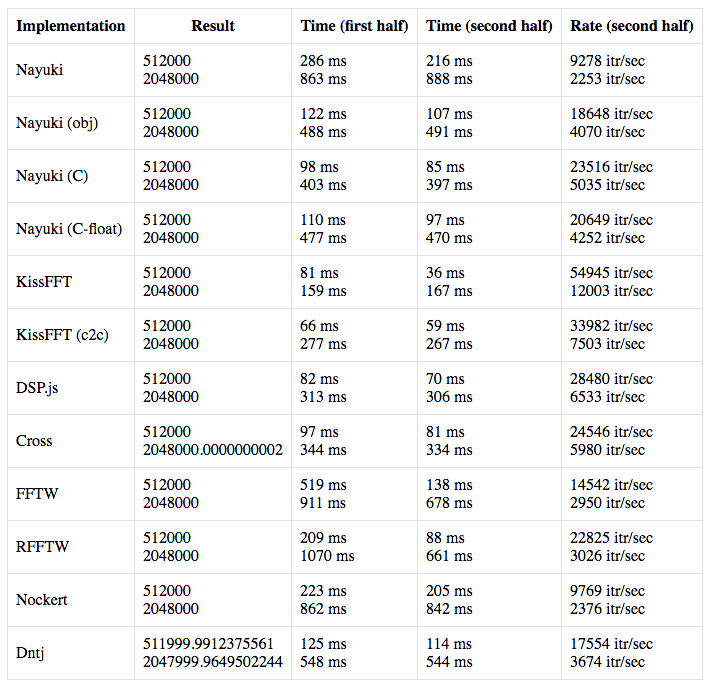

A quick evaluation of some FFT jobs in Javascript.
 

Uses existing library code where possible, and compares "Javascript source" with code compiled from other 
languages using Emscripten or similar. Only forward transforms are tested at this point (the inverse transforms may or may not produce the right results).

You can run these tests in a browser by checking out this repo and opening the file `fft/index.html`.

I've added a modified version of the DSP.js FFT and a Real-to-Real algorithm from FFTW. If you like you can see 
the original Mercurial repository by Chris Cannam 
(from which this is forked) [here](https://code.soundsoftware.ac.uk/projects/js-dsp-test).
